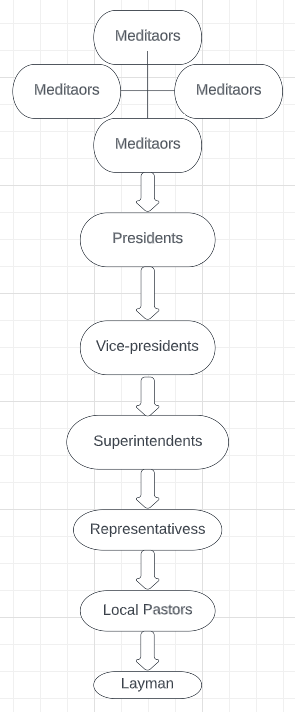

# first-database
I created my first database using PostgreSQL. This database models the Christian church hierarchy. I created this database to get some experience creating, optimizing, and managing a database in a topic I didn't know much about. The Christian church hierarchy can be visualized below.

Starting at the top a handful of people mediate information between presidents that are in charge of different countries. From there the diagram is self explanatory, the position above manages many people directly below them. For example, superintendents manage many representatives and a representative manages many local pastors. For every church, there is one pastor and a group of elders that advise the pastor. A few things to note are that every position goes to a church where a pastor is in charge of. Most likely only the president has the time to be the pastor of the church he goes to. A given is that a local pastor is already the pastor of their church and a layman cannot be a pastor of a church. A few things to note are that there are other groups in the church like researchers and colleges of Christianity but they are not included. Lastly, any position can be a minister, a title that shows you completed a course plan for Christianity in the church, after being a minister you can study further to be a congressional minister. 
